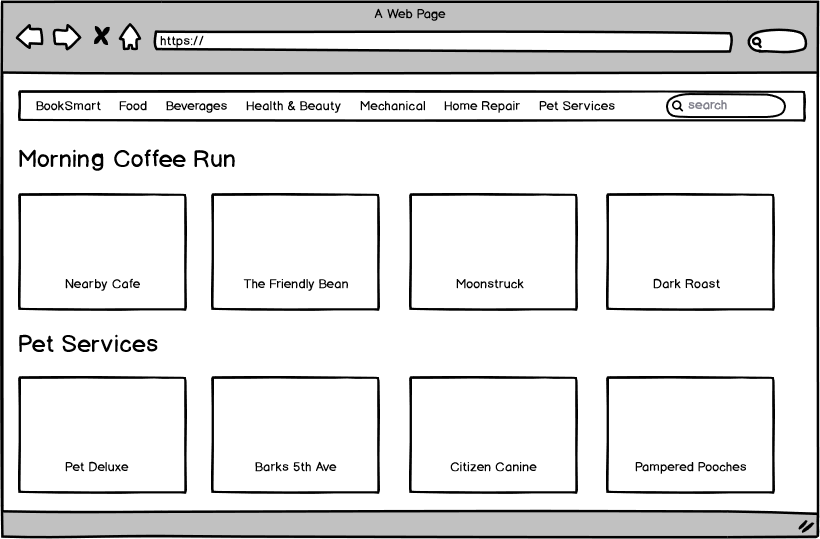
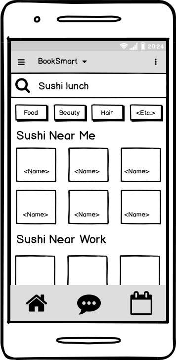
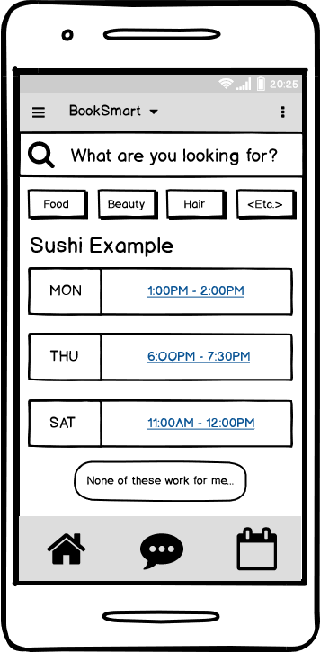

# Seneca Covid-19 Response Hackathon

## Challenge Set

Appointment scheduling for services, order pickups and restaurant seating. Sponsered by [CPOS](https://cpos.com/).

## Solution

BookSmart - A smart booking app focused on small-to-mid sized business that will assist the scheduling of appointments, generate automatic notifications for scheduled bookings and keep customers in touch with service providers for a personalized experience.

### Requirements
-	Cross-platform (Android, iOS)
-	Service/Business Agnostic
-	Seamless integration with existing systems

### Functional Description

**Localized Search**
- Search results populate based on current location and historical data

**Automatic Scheduling Suggestions**
- Based on customer’s Google or iCal schedule and business’ available time slots
- Customer may set custom preferences in settings (ex. No lunch appointments before 12MPM)

**Automatic Text Notifications**
- Reminders for bookings are sent via text, includes a suggested time to leave and arrive at booking location
- Generates time based on customer’s current proximity to booking location and estimated travel time according to preferred method of transportation

**Direct client-to-service chat**
- Client can ask questions and make specific requests to the business via chat within the application
- Business owners/managers can send special notifications and make inquiries if the client is running late. They may also inform clients of rescheduling or cancelations.

**Rescheduling Suggestions**
- If client needs to cancel, the application generates several possible alternative time slots based on the customer’s preferences and the business’ available time slots.

 &nbsp;&nbsp;&nbsp;&nbsp;

